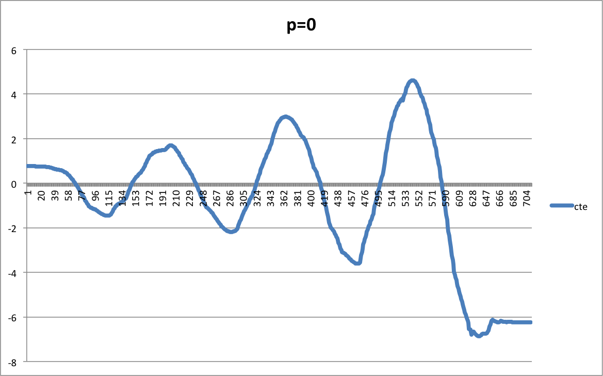
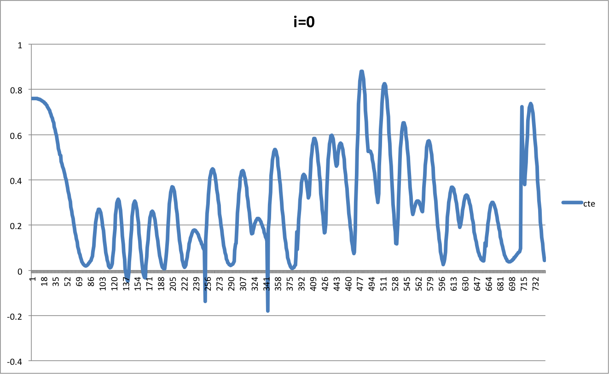
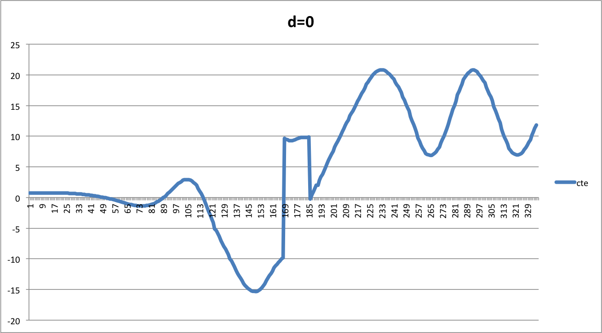
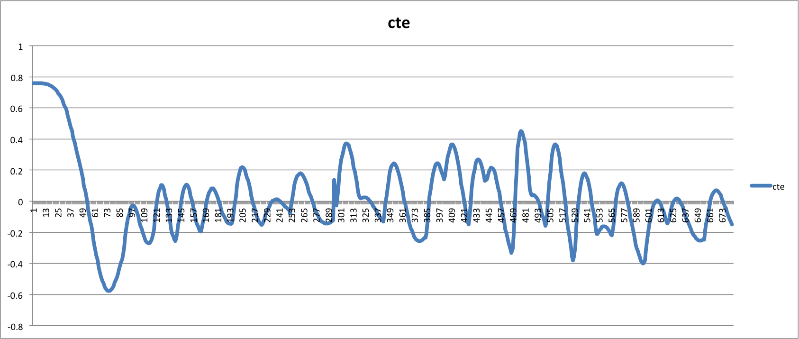

# CarND-Controls-PID
Self-Driving Car Engineer Nanodegree Program

---

## Effect of P, I, D

### P
Altering the P component effects how quickly the steering will converge. If the P is larger, than the car will swerve more quickly and get to the solution faster. If it swerves too quickly, then it will run off the road.  See this chart for what happens when the P is set to 0:

It starts out converging, but as the road curves, it can't keep up and ends up off the course.

### I

If we set the I component to 0, we see that the car is more unstable.  This component is set in our solution to nearly 0, so it doesn't make as big an impact.

### D

If we ignore the D term (set it to zero) then the car does really poorly after each curve and will run off the road. 

## PID Choice

The first solution for the PID values were taken from the online homework. I started with those values, and hand tuned the P term so that it would converge a bit faster by increasing the value.  I changed the other terms, but went back to the original values because they seemed to work well.  

This is the chart of the convergence: It oversteers at first, but settles in.  Each curve it has to readjust and converge again. 

